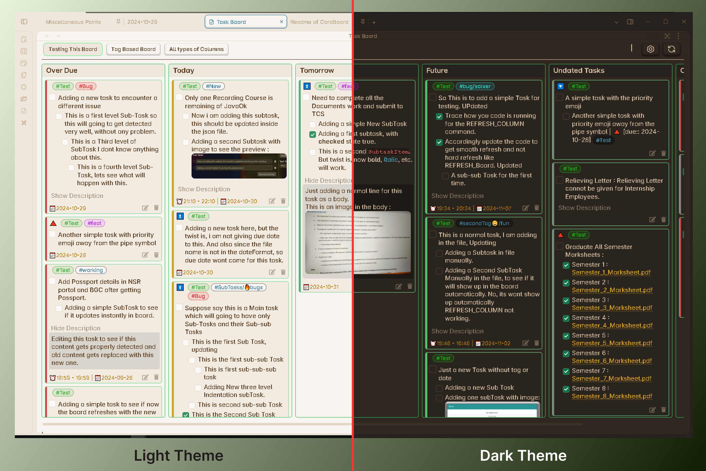
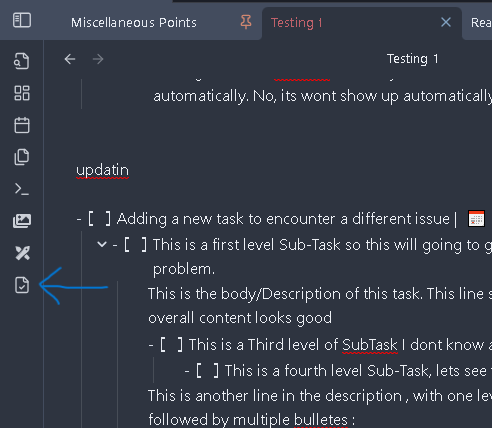
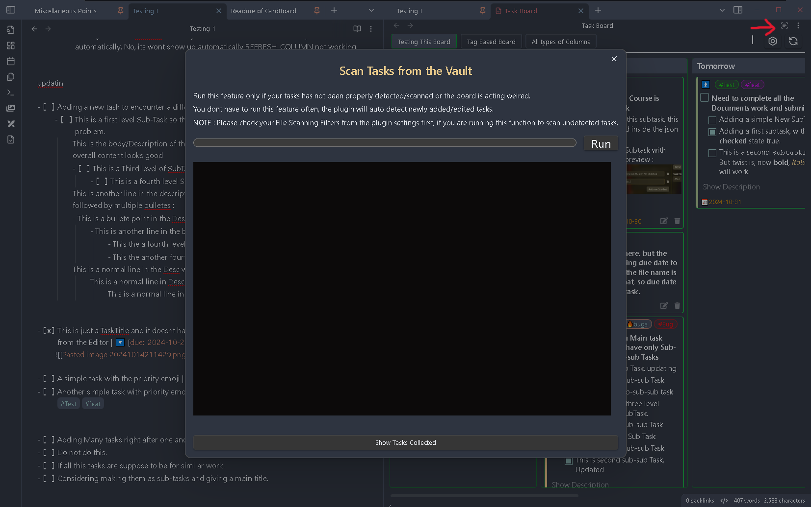
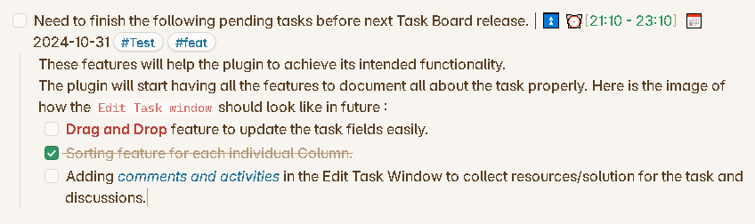
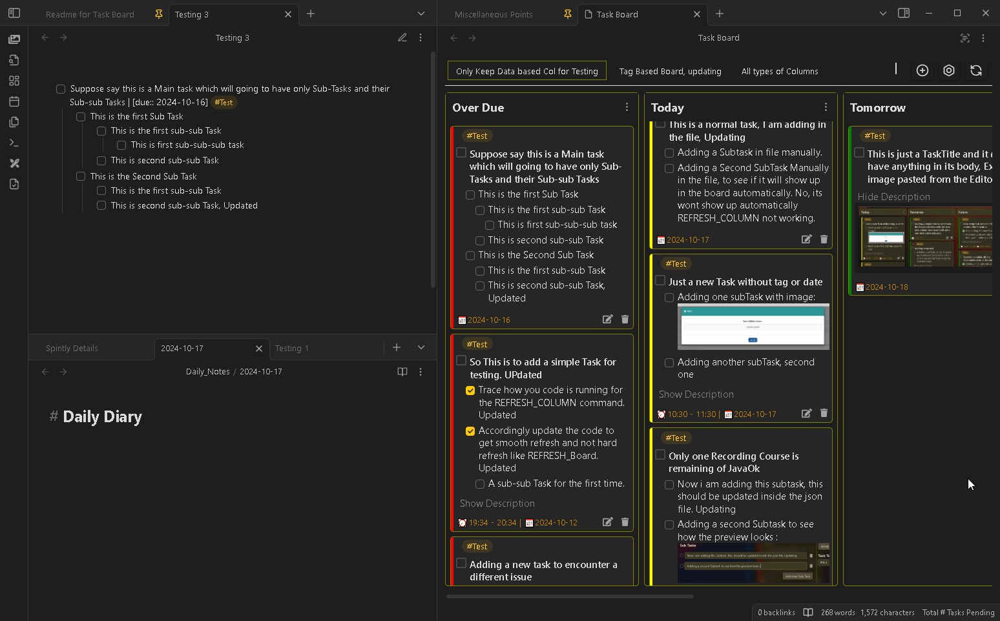
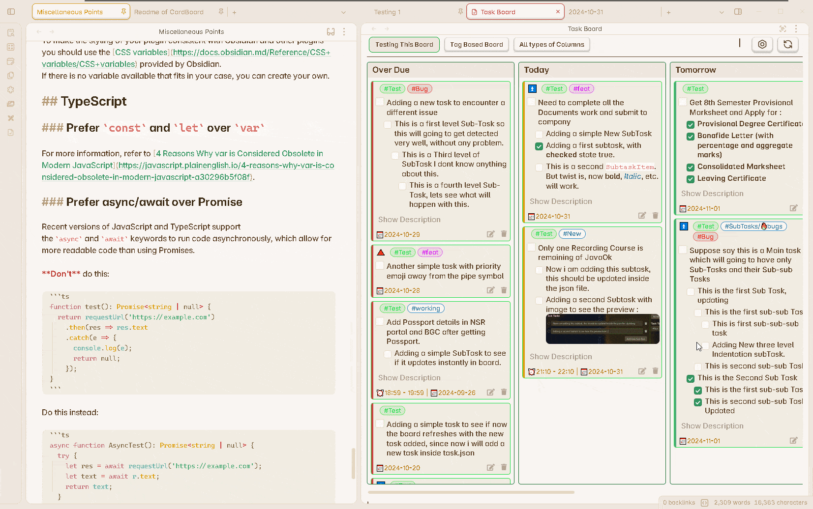

<h1 align="center"><b>Task Board</b></h1>
<h3 align="center"><b>"Document your progress while completing your tasks"</b></h3>
<br/>
<p align="center">
    <a href="https://github.com/tu2-atmanand/Task-Board/stargazers"></a>
    <a href="https://github.com/tu2-atmanand/Task-Board/issues"></a>
    <a href="https://github.com/tu2-atmanand/Task-Board/contributors"></a>
    <br/>
	<a href="https://obsidian.md/plugins?id=task-board"></a>
<!-- 	<a href=""></a> -->
	<a href="[https://img.shields.io/github/v/release/tu2-atmanand/Task-Board?style=flat-square](https://img.shields.io/github/v/release/tu2-atmanand/Task-Board)">
    <a href="./LICENSE"></a>
</a>
</p>
<br/>

An Obsidian plugin to view and manage all your tasks, throughout the vault in a much more efficient Kanban Board format.

> Inspired from [CardBoard Plugin](https://github.com/roovo/obsidian-card-board) by [roovo](https://github.com/roovo).



The main idea behind this plugin is to be able to document all your work from start to end while you are completing the specific task. You will be easily open the specific task without opening the markdown file and add the solution, points, resources you have found about the task and add sub-tasks in it. This feature has been inspired from the [GitHub Projects Board Layout](https://docs.github.com/en/issues/planning-and-tracking-with-projects/customizing-views-in-your-project/changing-the-layout-of-a-view#about-the-board-layout). The plan is to replicate whole GitHub Projects feature into Obsidian, to maintain your private personal projects or even create a private collaborative workspace.

## **Documentation**

This readme will only provide a basic information, Ill highly recommend to go through the docs to understand the plugin better and to use the Task Board efficiently : [Task Board Documentation](https://tu2-atmanand.github.io/task-board-docs/).


## How Does it work ?

- It scans tasks from all the Markdown files from your whole vault and show them on a Kanban type Board.
- Edit the task directly from the Task Board, without opening the Markdown file.
- See Real-TIme changes in the parent markdown file.
- Add task to currently opened files using a pop-up window.

## How to start ?

**Step 1 :** Install and Enable the plugin.

**Step 2 :** Open Task Board using the Icon from the right side Ribbon Icon Bar. Or there is a command in the Command Pallet.



**Step 3 :** Click on the Re-Scan Vault button from the top-right in the Task Board view header as shown in below image. Then click on the run button and it will scan all your files to look for tasks. (read the docs to learn more about it and apply filters to scan only specific files)



**Step 4 :** There are already two predefined board for your convenience as an example. Feel free to delete or edit the boards and [create your own boards](https://tu2-atmanand.github.io/task-board-docs/How_To/HowToCreateNewBoard.html) from the Configure Board Settings. Enjoy !


## Features

### Task Formats

This plugin will only detect and work with the checkbox items/tasks which are in the following format :

```md
- [ ]
```

If you dont want this plugin to detect your tasks, you are free to use the below format to define your tasks/checkbox items :

```md
* [ ] 
+ [ ] 
```

The task can have metadata like due date, time duration, tags, priority, etc separated by pipe symbol. Additionally, you can add multi-level sub-tasks and body description with images and files with the accepted format as explained in the docs. Following is an example of a task :



### Adding a Task

There are two way to add/show your task.

**Obvious Method :** Your old way of adding a task, that is directly writing inside the markdow files. After you have written the content of the task switch you focus away from the editor, like click on the Task Board and your task will be directly added in the board. Provided you havent applied any [Scan Filters](https://tu2-atmanand.github.io/task-board-docs/Features/Filters_for_Scanning.html).


**Using Command :** The plugin provides a command to open a `Add New Task` pop-up window to add task and many more functionalities directly using input elements. Assign a shortcut to this even more easier.


### Marking as Complete

Marking a Task as complete from the board is real-time, as soon as you will mark or unmark the task, the changes will be instantly made in the parent markdown file.


### Editing a Task

Edit task directly from the Edit Task Window. You can add different properties to the task, add more subTask, add or edit description to the task. And the changes will be return to the parent markdown file exactly the way you see it in the preview.



### Deleting a Task

Directly delete unwanted task from the board using the delete Icon. The task will aslo be deleted from the parent markdown file.

### Applying Filters

Apply Board filters to filter out and see the urgent tasks on the board with ease. Filters for Columns coming soon.


## Upcoming Features

- **Task Sorting :** Sorting feature for each individual Column.
- **Task Searching :** Search any task from any board.
- **New Column Type :** Similar to the `Dated` and `Tagged` type of columns, a new column type on `priority` will be added.
- **Drag N Drop for Tasks :** User will be able to drag and drop tasks from one column to another for easy editing fields.
- **Temporary Task :** User will be able to add a temporary task which is not required to be saved in any file.
- **New Board Type :** A new type of Board knows as `Markdown` will be added, which will work with a single markdown file, similar to the Kanban Plugin.
- **Comments and Activity :** From the Task Popup window, you can add comments to the task, which will help you to document everything you were doing while working on this task, similar to Github Projects Kanban boards.


## How to Contribute

You can contribute to this project by :

**1. Requesting a new feature, suggesting an improvement or reporting a Bug :** [How to create a new request](https://tu2-atmanand.github.io/task-board-docs/Advanced/HowToCreateRequest.html).

**2. Improving the translated languages or add a new language :** [How to Contribute for Language Translation](https://tu2-atmanand.github.io/task-board-docs/Advanced/Contribution_For_Languages.html).

**3. Contribute to the Development of the plugin Code :** : [How to join the plugin developme](https://tu2-atmanand.github.io/task-board-docs/Advanced/HowToJoinDevelopment.html).


## Motivation for the Project

I always used the [Kanban Plugin](https://github.com/mgmeyers/obsidian-kanban) to manage my tasks. And it use to work nice for me with all the amazing features. But as soon as I came across the CardBoard Plugin eveything changed. The idea of adding tasks anywhere in your vault and managing them from a single board amazed me. While using kanban plugin the issue was, i wasnt able to add tasks directly to any markdown file, i was required to use the Kanabn Board only to add/edit my tasks, and it use to keep all this tasks in a single markdown file. I immediately switched to the CardBoard plugin after I came across it. But after using it for few days, i realized there are few important features this plugin is lacking and hence I went to first contribute to the main project, but I wasnt familiar with the elm files, hence decided to start my own plugin.

While development I took inspirations from CardBoard and Kanban plugin as well as many feature ideas from [GitHub Project KanBan board](https://docs.github.com/en/issues/planning-and-tracking-with-projects/customizing-views-in-your-project/changing-the-layout-of-a-view#about-the-board-layout). I hope I am able to give the best of all this three plugins into one, and will be improving this further.

## Support

A great effort of work has been put into this idea to make it happen. I created the plugin for personal use, but I believed it will surely help other to make their work easier in managing tasks and handling project. If you have got benefitted with this plugin, consider donating for further improvement of this idea.

[](https://github.com/sponsors/tu2-atmanand)

<a href="https://www.buymeacoffee.com/tu2_atmanand"></a>

## License

Task Board is licensed under GNU GPL V2. Refer to [LICENSE](https://github.com/tu2-atmanand/Task-Board/blob/main/LICENSE) for more information.
